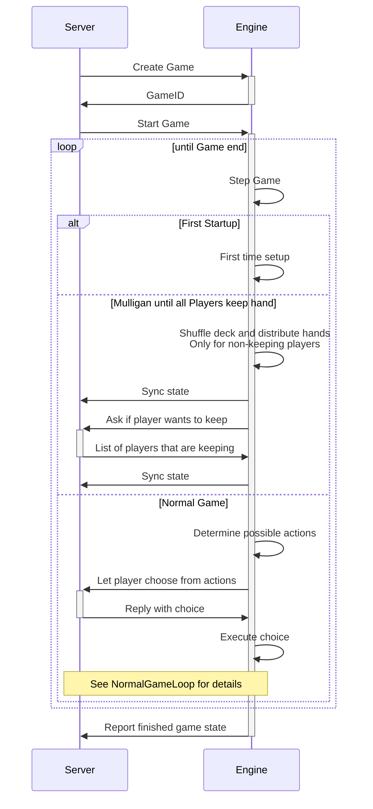
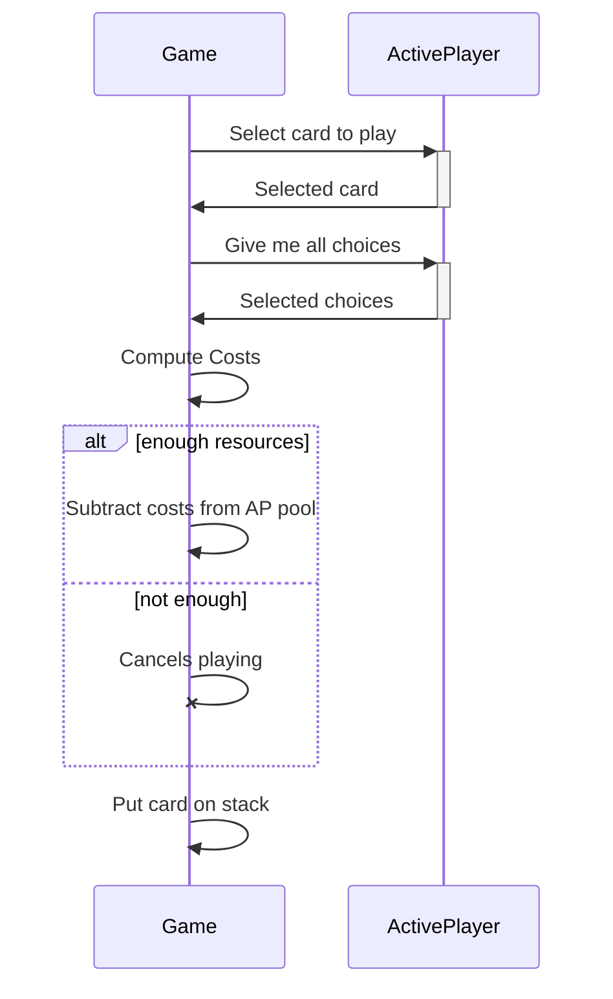

The game engine execution has the following shape:

## Overview

The backend server, here denoted `Server`, is the organizing part of the whole structure. It's job is to serve as the liason between players and the engine.

## The normal game loop

Most of the time spent in a technomancy game is going to follow this sequence:

### Playing a card

